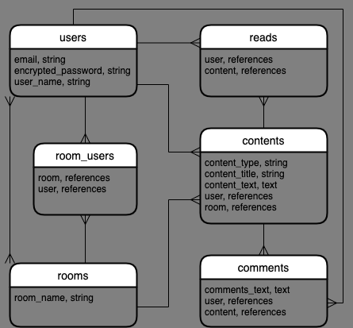

# アプリケーション名
## Spinach
 

# アプリケーション概要
## 報連相に特化したチャットアプリ
 

# URL
## https://spinach-sprout.herokuapp.com/
 

# テスト用アカウント
## userA
メールアドレス: a@a  
パスワード: aaa111
## userB
メールアドレス: b@b  
パスワード: bbb222  
 

# 利用方法
### ユーザー登録し、新規部屋を作成する。
### メッセージフォームから報連相を選んでコンテンツ投稿。
### コンテンツに対して既読をつけることができる。
### コメントで投稿に関してコミュニケーションがとれる。
 

# 目指した課題解決
### ビジネス上の情報共有をしやすく。
### 報連相が簡単にできる環境づくり。
 

# 洗い出した要件
要件定義スプレッドシート  
https://docs.google.com/spreadsheets/d/1NtJ-3_15_ml1d7xyTv-cNP6SNQ-l5TbhjsJWHJtE5sI/edit?usp=sharing  
 

# 画像・GIF
更新予定  
 

# 実装予定機能
ユーザー情報編集機能  
新規部屋作成モーダル化  
コンタクトフォーム実装  
既読非同期化  
コメント非同期化  
コンテンツ投稿非同期化  
ActionCableによるコンテンツのユーザー間非同期化  
モデル単体テストコード、結合テストコード記述  
 

# データベース設計

 
 

# ローカル動作方法
Ruby-version: 2.6.5  
 

# テーブル設計

## users テーブル

| Column             | Type   | Options     |
| ------------------ | ------ | ----------- |
| email              | string | null: false |
| encrypted_password | string | null: false |
| user_name          | string | null: false |

### Association

- has_many :room_users
- has_many :rooms, through: room_users
- has_many :reads
- has_many :contents
- has_many :comments

## room_users テーブル

| Column | Type       | Options                        |
| ------ | ---------- | ------------------------------ |
| user   | references | null: false, foreign_key: true |
| room   | references | null: false, foreign_key: true |

### Association

- belongs_to :room
- belongs_to :user

## rooms テーブル

| Column    | Type   | Options     |
| --------- | ------ | ----------- |
| room_name | string | null: false |

### Association

- has_many :room_users
- has_many :users, through: room_users
- has_many :contents

## reads テーブル

| Column  | Type       | Options                        |
| ------- | ---------- | ------------------------------ |
| user    | references | null: false, foreign_key: true |
| content | references | null: false, foreign_key: true |

### Association

- belongs_to :user
- belongs_to :content

## contents テーブル

| Column        | Type       | Options                        |
| ------------- | ---------- | ------------------------------ |
| content_type  | string     | null: false                    |
| content_title | string     | null: false                    |
| content_text  | text       | null: false                    |
| user          | references | null: false, foreign_key: true |
| room          | references | null: false, foreign_key: true |

### Association

- belongs_to :user
- belongs_to :room
- has_many :reads
- has_many :comments

## comments テーブル

| Column       | Type       | Options                        |
| ------------ | ---------- | ------------------------------ |
| comment_text | text       | null: false                    |
| user         | references | null: false, foreign_key: true |
| content      | references | null: false, foreign_key: true |

### Association

- belongs_to :user
- belongs_to :content